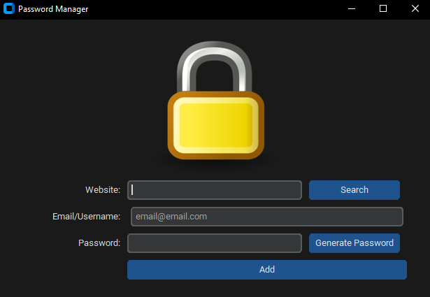

# Password Manager

Welcome to my Password Manager project! This Python application provides a convenient way to manage your website credentials. With this tool, you can generate strong passwords and store them for quick access whenever you need them.

## Features

- Generate strong and random passwords.
- Store website details, including website name, email, and password.
- Retrieve stored credentials quickly.
- User-friendly graphical interface built with CustomTkinter.
- Passwords are stored in a JSON file.

## Usage

Adding a New Credential:
Enter the website name, email/username, and click the "Generate Password" button to generate a strong password or enter your password manually.
Click the "Add" button to save the credentials.

Finding a Password:
Enter the website name and click the "Search" button.
The stored email and password for that website will be displayed.
